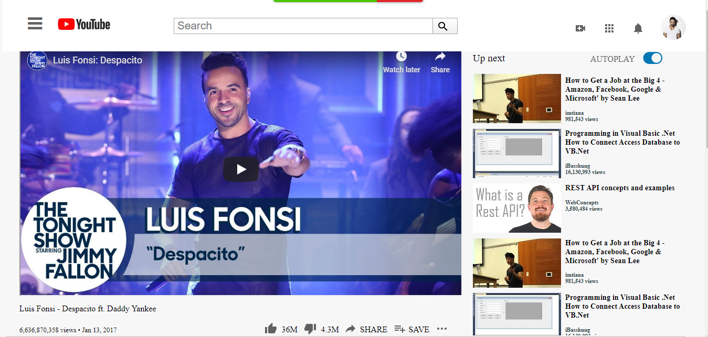

**Project Name: Embeding images and video in a webpage.**
This project consists of building an HTML document that matches the appearance of youtube page.
The aim of the project is to apply the use of pure HTML5 elements and CSS3 to setup a basic webpage structure using the semantic HTML5. It also involves positioning of elements in the right position on the page.

This project is purely a clone of a youtube page. The webpage contains the youtube logo at the top left corner, the search button beside the search input space whict is centrally located at the top of the page. It has the profile picture of a user. The main body contains an embeded video with related video images and description by the right side. Below the embeded video are the description of the video, number of views, likes, share buttons etc. There is a place to make public comment by whoever is viewing the video. Previous comments by various people indicating number of likes, replies etc also comes below the comment area.

Built With:
HTML5 and CSS3 are the major technology used in building this project.
CSS Grid is used for the page layout.

Live Demo
[Live Demo](https://rawcdn.githack.com/Zubenna/youtube-clone/7f6417134a9f45ecfef1b83cb50712c186c86f88/index.html)

Getting Started
Access the Project GitHub repository using the link above. Clone the project repository to your local machine. Navigate to the project folder and open the index.htm file with any browser of your choice. The cloned youtube page will be displayed in your browser.

Authors

Author1
* GitHub:[@github/3rkeen](https://github.com/3rkeen)
* Twitter:[@twitter/3rkeen](https://twitter.com/3rkeen)
* Linkedin:[linkedin/ErkinSheraliev](https://www.linkedin.com/in/erkin-sheraliev-9122631a0/)

Author2
* GitHub:[@github/Zubenna](https://github.com/Zubenna)
* Twitter:[@twitter/zubenna](https://twitter.com/zubenna)
* Linkedin:[linkedin/NnamdiEmelu](https://www.linkedin.com/in/nnamdi-emelu-08b14340/)

**Contributing**
handshake Contributing
Contributions, issues and feature requests are welcome!

Feel free to check the issues page.

**Show your support**
Give a star if you like this project!

